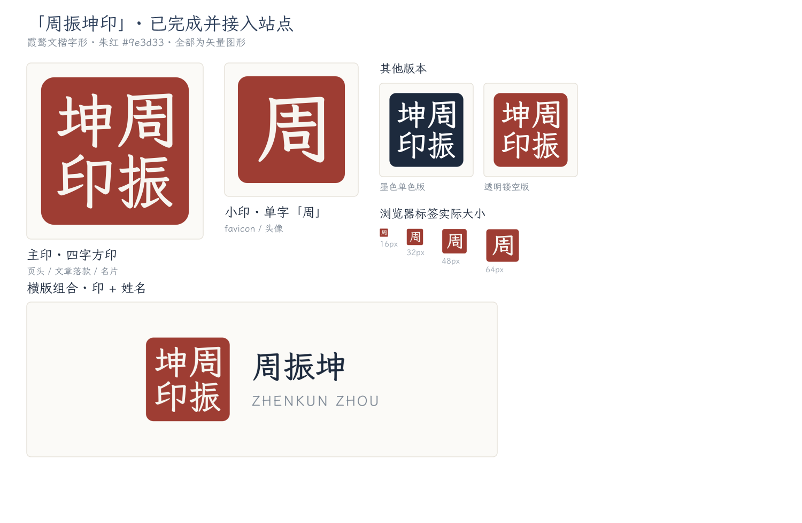

# 周振坤印 · 品牌资源

站点 logo 采用传统印章形式，四字朱文方印「周振坤印」。

## 设计规格

- **字形**：霞鹜文楷 Medium（LXGW WenKai），与站点正文字体一致，字形已转为矢量路径，不依赖字体安装
- **朱红**：`#9e3d33`（较正朱红略沉，屏幕与印刷都稳定）
- **字底**：`#f7f5f0`（米白，非纯白，接近宣纸）
- **排布**：传统印章读序，右上「周」→ 右下「振」→ 左上「坤」→ 左下「印」
- **画布**：256×256，圆角 22

## 文件清单

### 站点已启用（`public/`）
| 文件 | 用途 |
| --- | --- |
| `favicon.ico` | 多尺寸图标（16/32/48/64/128/256），单字「周」 |
| `favicon.png` | 48px 备用 |
| `favicon.svg` | 矢量图标，单字「周」 |
| `apple-touch-icon.png` | 180px，iOS 添加到主屏 |
| `avatar.png` / `avatar.svg` | 头像，四字方印 |

### 品牌资源（`public/brand/seal/`）
| 文件 | 用途 |
| --- | --- |
| `seal-zhouzhenkun.svg` | 主印，四字方印 |
| `seal-zhou-mark.svg` | 小印，单字「周」 |
| `seal-zhouzhenkun-ink.svg` | 墨色单色版，深底场合 |
| `seal-zhouzhenkun-transparent.svg` | 透明镂空版，可叠任意背景 |
| `lockup-horizontal.svg` | 横版组合，印 + 周振坤 / ZHENKUN ZHOU |
| `*-1024.png`, `seal-512.png` | 位图导出 |

## 使用建议

- **大尺寸**用四字主印，**16–32px** 用单字小印，四个字在标签页尺寸会糊
- 深色背景用 `-ink` 或 `-transparent` 版本
- 印章周围留白不少于印面的 1/8，勿拉伸变形（务必等比缩放）

## 重新生成

```bash
cd design/logo
./export_assets.sh     # 重建矢量源并导出 public/ 下全部图标资源
```

该脚本可重复执行，结果一致。依赖：`fonttools`、`rsvg-convert`(librsvg)、`ImageMagick`，
以及本机安装的霞鹜文楷（`~/Library/Fonts/LXGWWenKai-*.ttf`）。

注意：`lockup-horizontal.svg` 中的文字已全部转为矢量轮廓，因此在未安装霞鹜文楷的
机器上也能正确显示。修改该文件请通过脚本重新生成，不要手写 `<text>` 元素。

原始被替换的图标备份在 `design/logo/_replaced-originals/`。

## 预览


